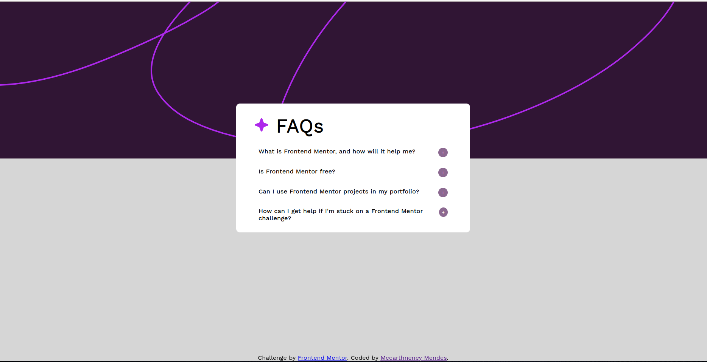

# Frontend Mentor - FAQ accordion solution

This is a solution to the [FAQ accordion challenge on Frontend Mentor](https://www.frontendmentor.io/challenges/faq-accordion-wyfFdeBwBz). Frontend Mentor challenges help you improve your coding skills by building realistic projects. 

## Table of contents

- [Overview](#overview)
  - [The challenge](#the-challenge)
  - [Screenshot](#screenshot)
  - [Links](#links)
- [My process](#my-process)
  - [Built with](#built-with)
  - [What I learned](#what-i-learned)
  - [Continued development](#continued-development)
  - [Useful resources](#useful-resources)
- [Author](#author)
- [Acknowledgments](#acknowledgments)

## Overview

The project came from a challenge from Frontend Mentor.
This challenge is a simple website with the function of hiding and showing information and hiding them

### The challenge

Users should be able to:

- Hide/Show the answer to a question when the question is clicked
- Navigate the questions and hide/show answers using keyboard navigation alone
- View the optimal layout for the interface depending on their device's screen size
- See hover and focus states for all interactive elements on the page

### Screenshot

### Links

- Solution URL: [Solution](https://github.com/mccartheney/frontendMentor-FAQ-accordion)
- Live Site URL: [Live site](https://658ec1fb3f2982ab25388494--peaceful-shortbread-362656.netlify.app/)

### Built with

- HTML5
- CSS3
- JavaScript

## Author

- GitHub - [Mccartheney](https://github.com/mccartheney)
- Intagram - [@mccartheneymendes](https://www.instagram.com/mccartheneymendes/)
